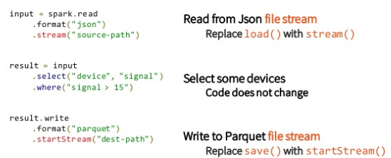

# New Features in Spark-2.0  & API History of Spark  顾亮亮  2016.06.29

---
# Agenda
- New Features in Spark-2.0
	- Tungsten Phase 2
	- Structured Streaming
	- Unifying Datasets and DataFrames
	- Other new Features in Spark-2.0
- API History Of Spark
	- Batch: RDD -> SparkSQL (DataFrame) -> Dataset
	- Streaming: DStream -> StreamingSQL -> Structed Streaming
	- Machine Learning: Row API -> ML Pipeline

---
# New Features in Spark-2.0

---
# Major Features in Spark-2.0

## 参考
- [Spark-2.0 By Matei Zaharia](http://download.csdn.net/detail/zhong930/9444260)
- [Technical Preview of Apache Spark 2.0](https://databricks.com/blog/2016/05/11/apache-spark-2-0-technical-preview-easier-faster-and-smarter.html)

---
# Tungsten

---
# Tungsten Phase 2

---
# TPC Performance

---
# Whole Stage Code Generation
## Code Generation VS Whole Stage Code Generation
- Code Generation: 仅仅是加快了表达式的求值(比如1+a)
- Whole Stage Code Generation: 为整个查询计划生成代码

# Whole Stage Code Generation
- 消除虚函数调用
- 将临时数据从内存中移到CPU寄存器中
- 利用现代CPU特性来展开循环并使用[SIMD](https://en.wikipedia.org/wiki/SIMD)功能，通过vectorization技术，可以加快那些代码生成比较复杂的算子运行速度

## 参考
- [SPARK-12795 Whole stage codegen](https://issues.apache.org/jira/browse/SPARK-12795)
- [SPARK-12992 Vectorize parquet decoding using ColumnarBatch](https://issues.apache.org/jira/browse/SPARK-12992)
- [Efficiently Compiling Efficient Query Plans for Modern Hardware](http://www.vldb.org/pvldb/vol4/p539-neumann.pdf)
- [Apache Spark作为编译器：深入介绍新的Tungsten执行引擎](http://geek.csdn.net/news/detail/77005)

---
# Structed Streaming API: Simple

---
# Structed Streaming

## 参考
- [Spark-8360](https://issues.apache.org/jira/browse/SPARK-8360)
- [A Deep Dive into Structed Streaming](https://spark-summit.org/2016/events/a-deep-dive-into-structured-streaming/)
- [Spark Summit 2016 Demo](Spark Summit 2016 Demo: Apache Spark 2.0)

---
# Structed Streaming = Infinite DataFrame
## DataFrame

## Structed Streaming

---
# Schedule

---
# Goal

---
# Unifying Datasets and DataFrames

---
# Spark-2.0其他Feature
- 新的ANSI SQL解析器，可以运行TPC-DS所有的99个查询
- SparkSession替代旧的SQLContext和HiveContext
- 新的Accumulator API，拥有更加简洁的类型层次，而且支持基本类型
- 基于DataFrame的Machine Learning API可以作为主要的ML API了
- Machine learning pipeline持久化：可以保存和加载Spark支持所有语言的Machine learning pipeline和models
- R的分布式算法：Generalized Linear Models (GLM), Naive Bayes, Survival Regression, and K-Means

---
# API History Of Spark

---
# RDD -> Structed Streaming

## Batch
1. RDD
2. SparkSQL(DataFrame)
3. Dataset

## Streaming
1. DStream (基于RDD API)
2. StreamingSQL (基于SparkSQL API) (Intel)
3. Structed Streaming (基于Dataset API)

## Machine Learning
1. Row API (基于RDD API)
2. ML Pipelines (基于DataFrame API)

---
# Spark API

---
# RDD API

## 参考
- [Resilient Distributed Datasets](http://people.eecs.berkeley.edu/~matei/papers/2012/nsdi_spark.pdf)

---
# DStream API
- RDD interfaces
- Windowing
- Incremental Aggregation
- Time-Skewed joins
- 静态编译成RDD执行

## 参考
- [Discretized Streams](http://people.eecs.berkeley.edu/~matei/papers/2012/hotcloud_spark_streaming.pdf)

---
# Shark -> SparkSQL(DataFrame)
## Shark: Hive on Spark

## SparkSQL(DataFrame)

## 参考
- [Shark: SQL and Rich Analytics at Scale](http://www.eecs.berkeley.edu/Pubs/TechRpts/2012/EECS-2012-214.pdf)
- [Spark SQL: Relational Data Processing in Spark](http://people.csail.mit.edu/matei/papers/2015/sigmod_spark_sql.pdf)

---
# SparkSQL(DataFrame API) (1.3.0)
## 架构

## 例子

---
# Fields based API
DataFrame API类似于Twitter Scalding的[Fields based API](https://github.com/twitter/scalding/wiki/Fields-based-API-Reference);

---
# DataSet API (1.6.0)

## DataSet API: Typed interface over DataFrame API
- RDD API可以进行类型检查，但是不能使用Catalyst进行优化
- DataFrame API可以使用Catalyst进行优化，但是不能进行类型检查
- Dataset API介于两者之间，即可以进行类型检查又可以使用Catalyst进行优化

## 参考
- [SPARK-9999](https://issues.apache.org/jira/browse/SPARK-9999)

---
# DataSet API (1.6.0) (CONT.)
### Spark-1.6
	!scala
	abstract class RDD[T: ClassTag] { ... }
	class DataFrame { ... }
	class Dataset[T] { ... }

### Spark-2.0
	!scala
	class DataFrame extends Dataset[Row]{ ... }

---
# Type Safe API
Dataset API类似于Twitter Scalding的[Type safe API](https://github.com/twitter/scalding/wiki/Type-safe-api-reference)。

---
# Thank U
