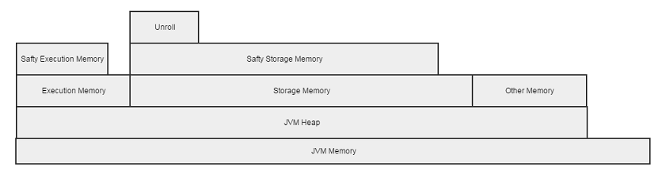
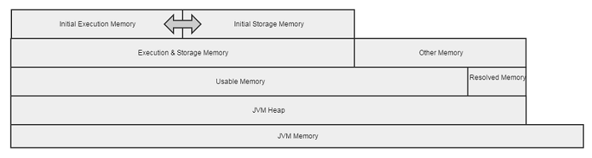
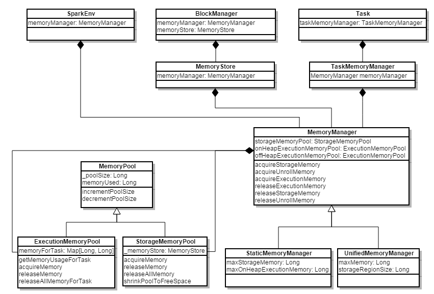

# Spark Memory Management  顾亮亮  2016.01.26

---
# Agenda
- Static Memory Manager
- Unified Memory Manager

---
# 为什么Spark需要管理内存？

---
# Static Memory Manager (in 1.5.0 and before)

---
# Static Memory Manager
## 1. Execution Memory
- 解决Shuffles, Joins, Sorts和Aggregations过程中为了避免频繁IO需要的buffer
- 通过参数spark.shuffle.memoryFraction(default=0.2)配置

## 2. Storage Memory
- 用来存储Block Cache(调用Rdd.cache, Rdd.persist等方法)
- 以及Broadcasts和Task Results
- 通过参数spark.storage.memoryFraction(default=0.6)设置

## 3. Other Memory
- 用户代码申请的内存，以及Spark内部使用的内存(defulat=0.2)

---
# Safety Fraction
为了避免OOM，Spark为每个存储区设置了Safety Fraction

## Execution Memory真正的可用内存是

- spark.shuffle.memoryFraction(default=0.2) * spark.shuffle.safetyFraction(default=0.8)
- 即0.2 * 0.8 = 16%

## Storage Memory真正的可用内存是

- spark.storage.memoryFraction(default=0.6) * spark.storagge.safetyFraction(default=0.9)
- 即0.6 * 0.9 = 54%

---
# Storgae Memory Unroll Fraction
- 用来保存Block Manage收到iterator类型的数据后展开的数据
- 通过参数spark.storage.unrollFraction(default=0.2)配置

---
# Static Memory Configuration
- spark.shuffle.memoryFraction(default=0.2)
	- spark.shuffle.safetyFraction(default=0.8)
- spark.storage.memoryFraction(default=0.6)
	- spark.storage.safetyFraction(default=0.9)
	- spark.storage.unrollFraction(default=0.2)

---
# Static Memory Manager的问题
1. 谁都不能超过自己的上限，规定了是多少就是多少，虽然另外一片内存空闲
2. 增加使用者配置的难度，需要根据应用的特性配置相关的参数

---
# Unified Memory Manager (since 1.6.0)

---
# Unified Memory Manager
## Executor向Storage借Memory
- Execution内存不足时，会触发向Storage申请内存
- 能借到的最大内存 = Max(Storage向Executor借的内存, Storage空闲内存)

## Storage向Executor借Memory
- Storage内存不足时，会触发向Executor申请内存
- 当且仅当Execution有空闲内存时，才能借走该内存

---
# Resolved Memory
- 配置参数spark.testing.reservedMemory(default=300M)
- usableMemory = 实际内存 - reservedMemory
- ExecutionMemory 和 StorageMemory 会共享usableMemory * spark.memory.fraction(defulat=0.75)的内存

---
# Unified Memory Configuration
- spark.memory.useLegacyMode(default=false)
- spark.testing.reservedMemory(default=300M)
- spark.memory.fraction(default=0.75)
- spark.memory.storageFraction(default=0.5)

---
# Code

---
# 类图

---
# Storage向Executor借内存
- UnifiedMemoryManager.acquireStorageMemory

---
# Executor向Storage借内存
- UnifiedMemoryManager.acquireExecutionMemory

---
# 初始化Memory Manager
- SparkEnv.create

---
# 使用Memory Manager
- BloackManager.初始化
- MemoryStore
	- tryToPut
	- evictBlocksToFreeSpace
- Executor.run
- TaskMemoryManager.acquireExecutionMemory

---
# MemoryConsumer
- spill()

子类

- BytesToBytesMap
- ShuffleExternalSorter
- UnsafeExternalSorter

---
# Further Questions?
- Memory Overhead
- Non-heap内存管理 (Tungsten)

---
# References
- [SPARK-10000 Consolidate storage and execution memory management](https://issues.apache.org/jira/browse/SPARK-10000)
- [Unified Memory Management in Spark 1.6
](https://issues.apache.org/jira/secure/attachment/12765646/unified-memory-management-spark-10000.pdf)
- [Spark 1.6 内存管理模型( Unified Memory Management)分析](http://www.jianshu.com/p/b250797b452a)
