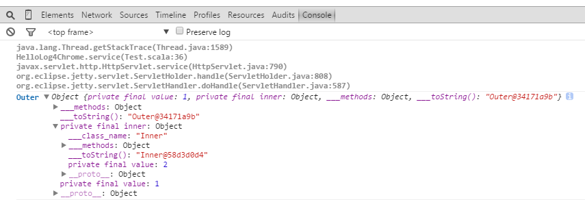

# ChromeLogger4j

### Links
- [调试一切！Chrome开发者工具推荐](http://mp.weixin.qq.com/s?__biz=MjM5MDE0Mjc4MA==&mid=205499659&idx=2&sn=1398d9275b663065f2edcc5bd1be6924#rd)
- [Chrome Logger 官网](https://craig.is/writing/chrome-logger)
- [Chrome Logger Github](https://github.com/ccampbell/chromelogger)
- [Chrome Logger Java Lib](https://code.google.com/p/chromelogger4j/)
- [Chrome Logger Java Source](http://chromelogger4j.googlecode.com/svn/trunk/src/name/yumaa/ChromeLogger4J.java)
- [Chrome Logger Chrome Plugin](https://chrome.google.com/webstore/detail/chrome-logger/noaneddfkdjfnfdakjjmocngnfkfehhd/related?hl=en)

### Example

Server Code:

    import javax.servlet.http.{HttpServlet, HttpServletRequest, HttpServletResponse}

    import name.yumaa.ChromeLogger4J
    import org.eclipse.jetty.server.Server
    import org.eclipse.jetty.servlet.{ServletContextHandler, ServletHolder}

    object Test {
      def main(args: Array[String]): Unit = {
        val server = new Server(8080)

        val context = new ServletContextHandler(ServletContextHandler.SESSIONS)
        context.setContextPath("/")
        server.setHandler(context)

        context.addServlet(new ServletHolder(new HelloLog4Chrome()), "/*")

        server.start()
        server.join()
      }
    }

    class Inner(val value: Int)
    class Outer(val value: Int, val inner: Inner)

    class HelloLog4Chrome extends HttpServlet {

      override def doGet(request: HttpServletRequest, response: HttpServletResponse) {
        val console: ChromeLogger4J = new ChromeLogger4J(response)
        console.stack = true
        console.reflect = true
        console.log(new Outer(1, new Inner(2)))
      }
    }

