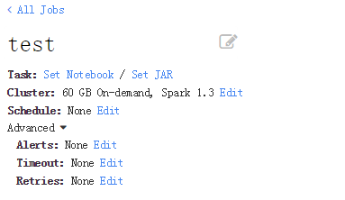
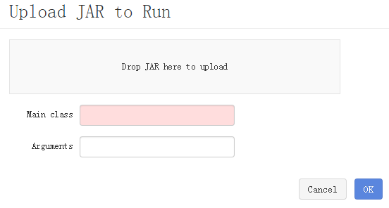
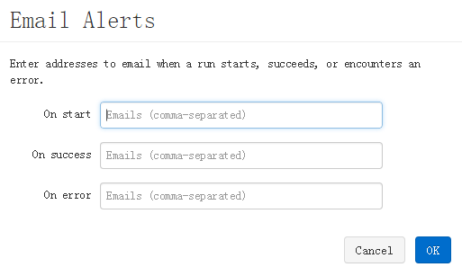
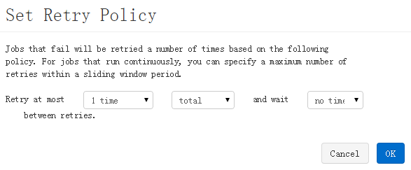
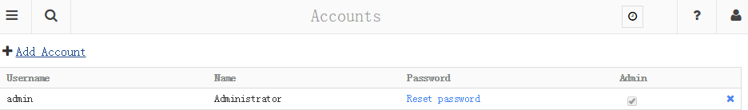

# Databricks Cloud
- [introduce](https://databricks.com/blog/2015/06/15/databricks-is-now-generally-available.html)
- [video1](https://www.youtube.com/embed/srI9yNOAbU0?autoplay=1)
- [video2](https://www.youtube.com/embed/MXI0F8zfKGI?autoplay=1)
- [video3](https://www.youtube.com/embed/2OYYPoJOU94?autoplay=1)

### Cluster

##### create a cluster

### Notebook

### Run Scala with SparkContext & SparkSQL

##### Notebook Graph

##### Edit Graph

### Job

##### Create a Job

##### Jar Job

##### Notebook Job

##### Alerts

##### Timeout

##### Retry

##### Schedule

### Table

##### Import Table

### Import Table from File

### Account

