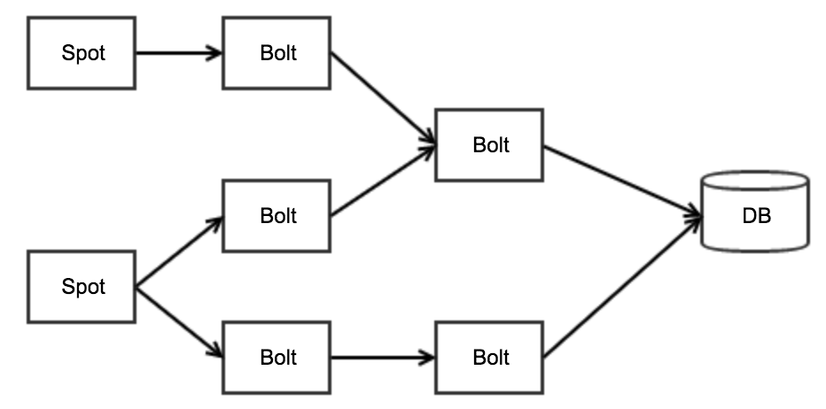
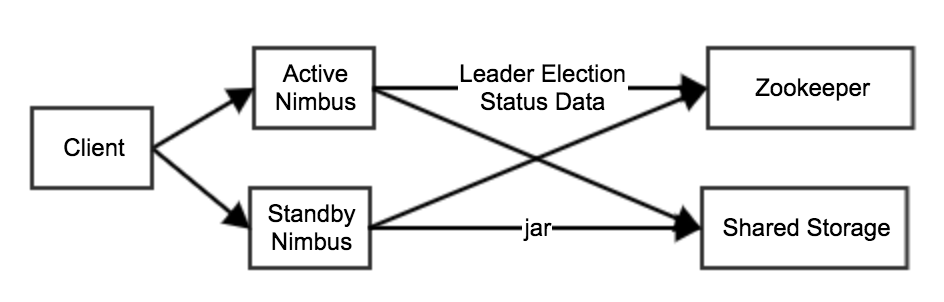

# Storm架构

## 流式系统的特点
Michael Stonebraker在论文The 8 Requirements of Real-Time Stream Processing中提出了在设计流式系统时需要考虑的8个条件：

1. Keep the Data Moving：低延迟
2. Query using SQL on Streams：支持StreamSQL
3. Handle Stream Imperfections (Delayed, Missing and Out-of-Order Data)：能处理延迟数据、丢失数据、乱序数据
4. Generate Predictable Outcomes：结果可预测
5. Integrate Stored and Streaming Data：能保存中间状态
6. Guarantee Data Safety and Availability：高可用HA
7. Partition and Scale Applications Automatically：可扩展
8. Process and Respond Instantaneously：低延迟

钟翔在设计Gearpump时又将这8个条件浓缩为5个字：活大快准见。

我觉得比较重要的几点：
- 高可用
- 可扩展性
- 低延迟
- 方便存储中间状态
- Exactly once语义
- 支持升级

## 单机版Storm

### 分布式Storm

http://storm.apache.org/releases/current/Understanding-the-parallelism-of-a-Storm-topology.html

## 高可用
### Nimbus高可用
http://storm.apache.org/releases/current/nimbus-ha-design.html

### Worker高可用

## Reliability
http://storm.apache.org/releases/current/Guaranteeing-message-processing.html

## 可扩展性
- Nimbus
- Zookeeper
- Worker：扩容worker数量

## 低延迟
来一条消息立即处理，延迟时间=数据处理步骤 * (数据处理时间 + 数据传递时间)

## StreamSQL
http://storm.apache.org/releases/current/storm-sql.html

## Exactly once语义：Trident
http://storm.apache.org/releases/current/Trident-tutorial.html

## 方便存储中间状态

## 支持升级

## Reference
- [Storm Github](https://github.com/apache/storm)
- [Storm文档](http://storm.apache.org/releases/current/index.html)
- [Storm Architecture](http://www.tutorialspoint.com/apache_storm/apache_storm_cluster_architecture.htm)
- [the-world-beyond-batch-streaming-101](https://www.oreilly.com/ideas/the-world-beyond-batch-streaming-101)
- [the-world-beyond-batch-streaming-102](https://www.oreilly.com/ideas/the-world-beyond-batch-streaming-102)
- [Gearpump：基于Akka的新一代流处理引擎](http://www.infoq.com/cn/presentations/gearpump-a-new-generation-stream-processing-engine)
- [The 8 Requirements of Real-Time Stream Processing](http://cs.brown.edu/~ugur/8rulesSigRec.pdf)
