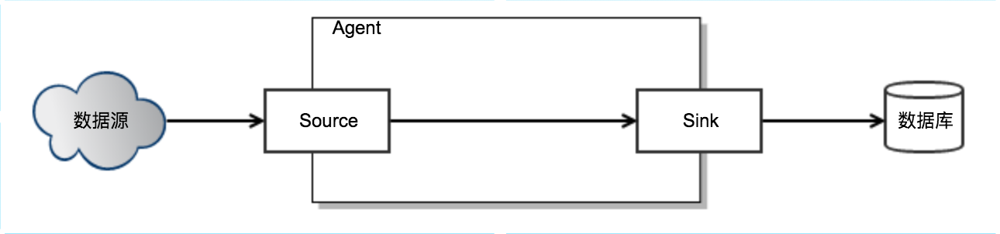
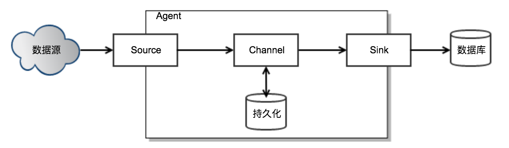
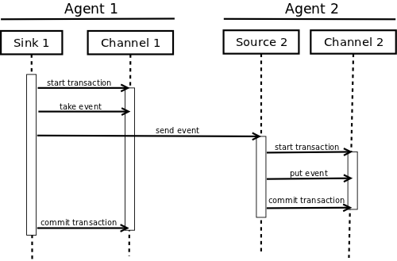
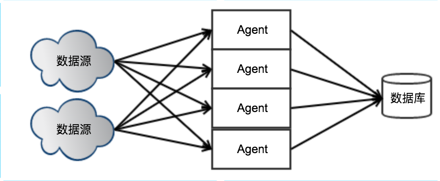

# Flume架构

Flume NG是Cloudera提供的一个分布式、可靠、可用的系统，它能够将不同数据源的海量日志数据进行高效收集、聚合、移动，最后存储到一个中心化数据存储系统中。

本文试图还原Flume的设计者设计Flume架构的过程。

## 单机版Flume
设计单机版的Flume需要考虑：
 1. 如何支持读取不同数据源的数据？
 2. 如何把数据写到不同的数据库？

于是可以抽象出以下几个概念：
- Source: 数据源可以抽象出一个Source接口，不同数据源只需要实现读取的逻辑，Source接口又可以分成两类：主动发送数据和被动读取数据。
- Event: Flume接收到数据以后，内部需要一个数据接口来表示数据，即：Event。
- Sink: 写数据同样需要抽象一个接口：Sink，不用数据库只需要实现写的逻辑。

整个Flume Agent的逻辑就是，不断读取Source，变成内部的Event，然后把Event写到Sink。

## 如何解决生产者速度 > 消费者速度？
实现了简单的读取和写入的架构以后，接下来需要考虑一个实际问题：如何解决生产者速度 > 消费者速度的问题？当生产者速度 > 消费者速度时，生产者会被阻塞，这对日志收集系统是不能容忍的。

这个问题一个经典的解法就是在生产者和消费者之间加缓冲区：Channel。Agent中的Source线程负责读取数据并写到Channel，Sink线程负责从Channel中读取数据并写到外部数据库。

## 单机版：如果保证不丢数据？

### 如何保证Source不丢数据？
1. 被动接收数据，数据发送方支持重新发送 => 只有在成功写入channel后才返回成功，否则返回error，寄希望于数据发送方重发数据
2. 被动接收数据，数据发送方不支持重新发送 => 当写入Channel失败或者Agent挂掉时，会丢数据
3. 主动读取数据，数据源是可重复读取 => 需要主动记录当前offset，并且持久化offset，Agent重启后从持久化恢复offset，只有在成功写入channel后才更新offset
4. 主动读取数据，数据源是不可重复读取 => 当写入Channel失败或者Agent挂掉时时，会丢数据

### 如何保证Channel不丢数据？
1. Channel选择持久化存储（磁盘），Agent重启后Channel数据不会丢失
2. Channel满了，导致写入Channel失败 => 寄希望于Source有重试机制，否则会丢失数据
3. Agent所在机器挂了 => 保存在Channel中的数据丢失

### 如何保证Sink不丢数据？
Sink写数据在返回成功后再从Channel中删除数据。

### 如何保证Agent之间传递数据不丢数据？
Sink要在下游数据写到Channel后再从Channel中删数据，如果下游失败则回滚。

## 如何处理高并发？
要想让Flume支持高并发，前提是Source需要支持多个消费者访问。只需要部署多个Flume Agent，每个Agent读取数据源的某个部分，就可以轻松实现高并发。

## 分布式版：Agent挂了，如果保证不丢数据？
当部署了多个Agent后，如果某个Agent所在机器挂了，Agent无法重启，就会导致该Agent负责的数据无法读取，导致数据丢失。

解决办法：同一个数据源被分配给多个Agent，当某个Agent无法工作时，其他的Agent会接手这部分数据的传输任务。

## 如何控制Source的链接数？
假设数据源数量=n,每个Source会保存一个连接到数据源，即Source的连接数=n，当n变大后，Source无法同时保持很大的连接数。

解决办法：将Agent分组，某个组里面分配m个Agent，某个数据源只连接到某个分组，当n增大时可以通过增加分组数来减少连接数，当每个分组的Agent数量变少时，可以通过增加Agent来保持每个分组的Agent数量。

## 如何控制Sink的链接数？
每个Agent Sink都会和数据库保持一个连接，当Agent变多时，连接数最终会超过数据库的限制。

解决办法：将Agent进行分层。

## Reference
- [Architecture of Flume NG](https://blogs.apache.org/flume/entry/flume_ng_architecture)
- [Flume Github](https://github.com/apache/flume)
- [Flume Document](https://cwiki.apache.org/confluence/display/FLUME/Home;jsessionid=E7F7666DFE67BDEF020D03A64A845F62)
- [Flume Getting Started](https://cwiki.apache.org/confluence/display/FLUME/Getting+Started)
- [基于Flume的美团日志收集系统(一)架构和设计](http://tech.meituan.com/mt-log-system-arch.html)
- [基于Flume的美团日志收集系统(二)改进和优化](http://tech.meituan.com/mt-log-system-optimization.html)
- [美团对 flume 的扩展和改进](https://github.com/javachen/mt-flume)
