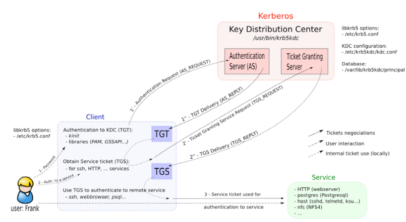
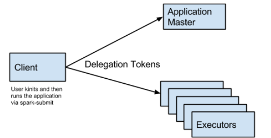

# Hadoop Kerberos的那些坑  顾亮亮  2015.11.03

---
# Agenda
- Kerberos Introduction
- Token Expired Problem when Hadoop meet Kerberos
- How Spark solve the Problem
- Hadoop Kerberos Programming API

---
# Kerberos (百度百科)
> Kerberos这一名词来源于希腊神话 三个头的狗——地狱之门守护者

---
# Kerberos (Wikipedia)
> Kerberos /ˈkərbərəs/ is a computer network authentication protocol which works on the basis of 'tickets' to allow nodes communicating over a non-secure network to prove their identity to one another in a secure manner.

---
# Authentication(认证) VS Authorization(授权)
- Authentication
> is the act of confirming the truth of an attribute of a single piece of data claimed true by an entity.

- Authorization
> is the function of specifying access rights to
resources related to information security and computer security in general and to access control in particular.

**Authentication is about who somebody is.**

**Authorisation is about what they're allowed to do.**

---
# Step 1: Authentication Service - TGT Delivery
**TGT: Ticket Granting Ticket**

From: [The MIT Kerberos Administrator’s How-to Guide](http://www.kerberos.org/software/adminkerberos.pdf)

---
# Step 2: Ticket Granting Service - TGS Delivery
**TGS: Ticket Granting Service**

---
# Diagrams

---
# Overal

---
# Token Expired Problem when Hadoop meet Kerberos

---
# Hadoop Authentication Flow

From: [Hadoop Security Design](http://www.valleytalk.org/wp-content/uploads/2013/03/hadoop-security-design.pdf)

---
# HDFS Authentication

### HDFS Delegation Token
- TokenID = {ownerID, renewerID, issueDate, maxDate, sequenceNumber}
- TokenAuthenticator = HMAC-SHA1(masterKey, TokenID)
- Delegation Token = {TokenID, TokenAuthenticator}

### Block Access Token
- TokenID = {expirationDate, keyID, ownerID, blockID, accessModes}
- TokenAuthenticator = HMAC-SHA1(key, TokenID)
- Block Access Token = {TokenID, TokenAuthenticator}

---
# Token Expired Problem when Hadoop meet Kerberos

1. keytab (long term)
2. TGT (max life time = 3 days)
3. TGS for NameNode (max life time = 3 days)
4. HDFS Delegation Token (max life time = 7 days)
5. Block Access Token (shot time)

**Proglem: Applications on Yarn cannot run > 7 days**

---
# How Spark solve the Problem

---
# Old Design

**Problem: cannot run > 7 days on Yarn**

---
# New Design from Spark-1.4.0

From: [Long Running Spark Apps on Secure YARN](https://issues.apache.org/jira/secure/attachment/12693526/SparkYARN.pdf)

**Upload Keytab to HDFS and login from Keytab before token expired**

[Spark-5342 Allow long running Spark apps to run on secure YARN/HDFS](https://issues.apache.org/jira/browse/SPARK-5342)

---
# Hadoop Kerberos Programming API

---
# UserGroupInformation (Hadoop)
    !java
    // Log a user in from a keytab file. Loads a user identity from a keytab
    // file and logs them in. They become the currently logged-in user.
    static void loginUserFromKeytab(String user, String path)

    // Log a user in from a keytab file. Loads a user identity from a keytab
    // file and login them in. This new user does not affect the currently
    static UserGroupInformation loginUserFromKeytabAndReturnUGI(String user,
                                                                String path)

    // Return the current user, including any doAs in the current stack.
    static UserGroupInformation getCurrentUser()

    // Re-login a user from keytab if TGT is expired or is close to expiry.
    void checkTGTAndReloginFromKeytab()

    // Add the given Credentials to this user.
    public void addCredentials(Credentials credentials)

    public Credentials getCredentials()

    // Run the given action as the user.
    public <T> T doAs(PrivilegedAction<T> action)

---
# UserGroupInformation Runtime

    !scala
    UserGroupInformation.loginUserFromKeytab(principal, keytab)
    val ugi = UserGroupInformation.getCurrentUser

---
# Subject (Java)
> A Subject represents a grouping of related information for a single entity, such as a person. Such information includes the Subject's identities as well as its security-related attributes (passwords and cryptographic keys, for example).

---
# Subject Runtime
    !scala
    val ugi = UserGroupInformation.getCurrentUser

---
# Subject.doAs

    !java
    /**
     * Perform work as a particular Subject.
     *
     * This method first retrieves the current Thread's
     * AccessControlContext via AccessController.getContext,
     * and then instantiates a new AccessControlContext
     * using the retrieved context along with a new
     * SubjectDomainCombiner (constructed using the provided Subject).
     * Finally, this method invokes AccessController.doPrivileged,
     * passing it the provided PrivilegedAction,
     * as well as the newly constructed AccessControlContext.
     *
     * @param subject the Subject that the specified
     *        action will run as.  This parameter may be null.
     */
    public static <T> T doAs(final Subject subject,
                        final java.security.PrivilegedAction<T> action)

---
# Use Cases

---
# Kerberos Configuration
    !scala
    System.setProperty("java.security.krb5.realm", "HADOOP.QIYI.COM")
    System.setProperty("java.security.krb5.kdc", "hadoop-kdc01")

---
# Use Case 1: kinit by crontab
Run once every day in crontab

    !bash
    kinit -l 3d -k -t ~/test.keytab test@HADOOP.QIYI.COM

Right:

    !scala
    val fs = FileSystem.get(new Configuration())
    while (true) {
      println(fs.listFiles(new Path("/user"), false))
      Thread.sleep(60 * 1000)
    }

**Kerberos will relogin automatically, when token is expired**

---
# Use Case 2: Login with Keytab File
Right:

    !scala
    UserGroupInformation.loginUserFromKeytab(principal, keytab)
    val fs = FileSystem.get(new Configuration())
    while (true) {
      println(fs.listFiles(new Path("/user"), false))
      Thread.sleep(60 * 1000)
    }

**Kerberos will relogin automatically, when token is expired**

Wrong:

    !scala
    UserGroupInformation.loginUserFromKeytab(principal, keytab)
    val fs = FileSystem.get(new Configuration())
    while (true) {
      UserGroupInformation.loginUserFromKeytab(principal, keytab)
      println(fs.listFiles(new Path("/user"), false))
      Thread.sleep(60 * 1000)
    }

**Do NOT call UserGroupInformation.loginUserFromKeytab again**

---
# Use Case 3: Muilti-User in Signle JVM
Wrong:

    !scala
    val ugi = UserGroupInformation.loginUserFromKeytabAndReturnUGI(principal,
                                                                  keytab)
    ugi.doAs(new PrivilegedExceptionAction[Void] {
      override def run(): Void = {
        val fs = FileSystem.get(new Configuration())
        while (true) {
          println(fs.listFiles(new Path("/user"), false))
          Thread.sleep(60 * 1000)
        }
        null
      }
    })

**Kerberos will NOT relogin automatically, when token is expired**

---
# Use Case 3: Muilti-User in Signle JVM (CONT.)
Right:

    !scala
    val ugi = UserGroupInformation.loginUserFromKeytabAndReturnUGI(principal,
                                                                  keytab)
    ugi.doAs(new PrivilegedExceptionAction[Void] {
      override def run(): Void = {
        val fs = FileSystem.get(new Configuration())
        while (true) {
          UserGroupInformation.getCurrentUser.reloginFromKeytab()
          println(fs.listFiles(new Path("/user"), false))
          Thread.sleep(60 * 1000)
        }
        null
      }
    })

**Call reloginFromKeytab before token is expired**

---
# Use Case 4: Using HDFS Delegation Token (Yarn Application)
Right:

    !scala
    val creds1 = new org.apache.hadoop.security.Credentials()
    val ugi1 = UserGroupInformation.loginUserFromKeytabAndReturnUGI(principal,
                                                                    keytab)
    ugi1.doAs(new PrivilegedExceptionAction[Void] {
      override def run(): Void = {
        val fs = FileSystem.get(new Configuration())
        fs.addDelegationTokens("test", creds1)
        null
      }
    })
    UserGroupInformation.getCurrentUser.addCredentials(creds1)

**Update credentials periodically before token expired**

---
# References
- [The MIT Kerberos Administrator’s How-to Guide](http://www.kerberos.org/software/adminkerberos.pdf)
- [Hadoop Security Design](http://www.valleytalk.org/wp-content/uploads/2013/03/hadoop-security-design.pdf)
- [Long Running Spark Apps on Secure YARN](https://issues.apache.org/jira/secure/attachment/12693526/SparkYARN.pdf)

---
# Related Patches
### Spark-1.4.0
- [Spark-5342 Allow long running Spark apps to run on secure YARN/HDFS](https://issues.apache.org/jira/browse/SPARK-5342)
- [SPARK-6918 Secure HBase with Kerberos does not work over YARN](https://issues.apache.org/jira/browse/SPARK-6918)
### Spark-1.5.0
- [Spark-8688 Hadoop Configuration has to disable client cache when writing or reading delegation tokens](https://issues.apache.org/jira/browse/SPARK-8688)
- [Spark-7524 add configs for keytab and principal, move originals to internal](https://issues.apache.org/jira/browse/SPARK-7524)

### Submit Patches
- [Spark-11182 HDFS Delegation Token will be expired when calling "UserGroupInformation.getCurrentUser.addCredentials" in HA mode](https://issues.apache.org/jira/browse/SPARK-11182)
- [HDFS-9276 Failed to Update HDFS Delegation Token for long running application in HA mode](https://issues.apache.org/jira/browse/HDFS-9276)
